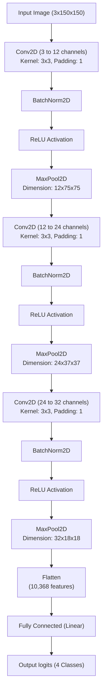

# 🖼️ Image Classification System

[](https://www.python.org/)
[](https://pytorch.org/)
[](https://jupyter.org/)
[](https://opensource.org/licenses/MIT)

A robust, self-contained **Image Classification System** built using **PyTorch** and a custom **Convolutional Neural Network (CNN)**. The system is designed to classify images into four distinct categories: **Cars**, **Cats**, **Dogs**, and **Flowers**. 

This repository includes a complete pipeline—from environment setup and automated dataset parsing to model training, evaluation checkpointing, and real-time inference on custom images.

---

## 🚀 Key Features

*   **Custom CNN Architecture:** Includes 3 Convolutional blocks with batch normalization, ReLU activation, and max pooling for feature extraction.
*   **Automated Data Pipeline:** Uses PyTorch `ImageFolder` and `DataLoader` to automatically structure, resize, normalize, and batch training and test sets.
*   **Robust Environment Checkpoints:** Features runtime crash fixes (e.g., Windows OpenMP duplicate library crash mitigation).
*   **Dynamic Weight Checkpointing:** Automatically tracks validation metrics and saves the best model state (`best_image_classifier.pth`) when test accuracy improves.
*   **Clean Inference Interface:** A user-friendly, single-function classification pipeline to test new, unseen images with instant feedback.

---

## 📁 Repository Structure

```directory
Image classification system/
├── Data set/
│   ├── Train/
│   │   ├── cars/
│   │   ├── cats/
│   │   ├── dogs/
│   │   └── flowers/
│   └── Test/
│       ├── cars/
│       ├── cats/
│       ├── dogs/
│       └── flowers/
├── best_image_classifier.pth      # Saved state dictionary of the highest-performing model
├── dataset_test.ipynb             # Full Jupyter Notebook containing dataset validation, model, training, and inference
└── README.md                      # Project documentation (this file)
```

---

## 🧠 Model Architecture

The custom CNN (`ImageClassifierCNN`) consists of three feature-extraction blocks followed by a fully-connected classifier:



---

## 🛠️ Getting Started

### 1. Prerequisites

Ensure you have Python 3.8+ and the following packages installed:

```bash
pip install torch torchvision pillow matplotlib jupyter
```

### 2. Dataset Preparation

Ensure your image files are organized in the following folder structure under the project root:

```text
Data set/
├── Train/
│   ├── cars/
│   ├── cats/
│   ├── dogs/
│   └── flowers/
└── Test/
    ├── cars/
    ├── cats/
    ├── dogs/
    └── flowers/
```

*The model expects input images to be automatically resized to `150x150` pixels during transformation.*

### 3. Execution & Training

1. Launch Jupyter Notebook or JupyterLab:
   ```bash
   jupyter notebook
   ```
2. Open `dataset_test.ipynb`.
3. Run the cells sequentially:
   * **Cell 1:** Verifies PyTorch installation, environment stability variables, and prints details about your training and test datasets.
   * **Cell 2:** Defines the custom CNN architecture and initializes it on the available device (GPU with CUDA or CPU).
   * **Cell 3:** Runs the training loop over 10 epochs. When a new highest test accuracy is met, weights are automatically saved to `best_image_classifier.pth`.

---

## 📈 Training Results & Performance

During training over **10 Epochs** using a batch size of `16` and the **Adam** optimizer (`lr=0.001`), the model achieved the following performance:

*   **Training Accuracy:** reached **100.00%** by Epoch 2.
*   **Test/Validation Accuracy:** stabilized at **100.00%** by Epoch 3.
*   **Best Checkpoint Saved:** `best_image_classifier.pth`

---

## 🔮 Inference & Predictions

To classify your own custom image, use the `classify_new_image()` pipeline function provided at the end of the notebook. 

```python
# Provide the absolute path of any local image
classify_new_image("C:/path/to/your/image.jpg")
```

**Example Output:**
```text
Prediction Result: This image contains a -> **CARS**
```

---

## 📝 License

This project is licensed under the MIT License - see the [LICENSE](LICENSE) file for details.
